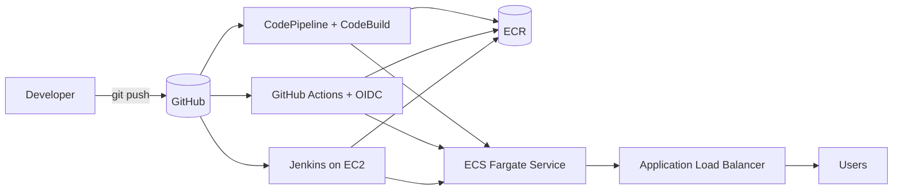

# 01 — CI/CD Fundamentals: One App, Three Pipelines

Deploy the same containerized service to **ECS Fargate** through three different pipelines — **AWS CodePipeline**, **GitHub Actions**, and **Jenkins** — backed by shared Terraform infrastructure. The point is to make the trade-offs between AWS-native, SaaS-hosted, and self-hosted CI/CD legible side-by-side.

## Architecture



## What this demonstrates
- **IaC**: VPC, ALB, ECS Fargate, ECR, IAM — modular Terraform, ready for remote state
- **Pipeline-as-code** in three tools, each landing the same immutable image tag onto the same ECS service
- **Least-privilege IAM**, including GitHub OIDC trust scoped to `repo + branch` (no long-lived keys)
- **Reproducibility**: `scripts/bootstrap.sh` brings the platform up; `scripts/teardown.sh` removes it

## Stack
| Layer | Tools |
|---|---|
| Infra | Terraform 1.6+, AWS provider 5.x |
| Runtime | ECS Fargate, ALB, ECR, CloudWatch Logs |
| App | Node.js 20, Express, Docker (multi-stage, non-root) |
| CI/CD | CodePipeline + CodeBuild, GitHub Actions, Jenkins |

## Run it
```bash
# 1. Provision the shared platform (VPC + ECS + ECR + ALB)
./scripts/bootstrap.sh

# 2. Push the first image so the service can start
./scripts/deploy-image.sh

# 3. Pick a pipeline (only one needed):
#    samples/codepipeline/    -> terraform apply (needs a CodeStar GitHub connection)
#    samples/github-actions/  -> terraform apply (OIDC), then commit deploy.yml
#    samples/jenkins/         -> point a Jenkins job at this repo using Jenkinsfile
```

## Cleanup
```bash
./scripts/teardown.sh
```

> Cost note: ALB + a single Fargate task accrue ~USD 0.50/day idle. Tear down when not in use.
